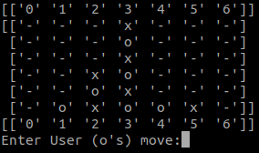
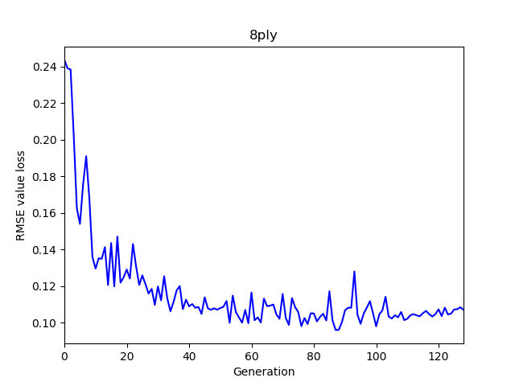
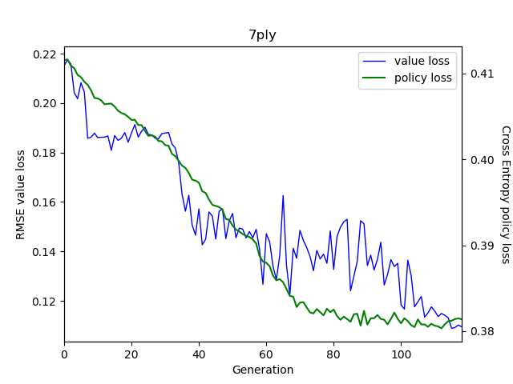

<pre>
 _________________
< I like connect4 >
 -----------------
   \
   \   _//| .-~~~-.
     _/oo  }       }-@
    ('')_  }       |
     `--'| { }--{  }
          //_/  /_/
</pre>

[Image origination](https://github.com/sckott/cowsay)

# Intro
Using reinforcement learning to train an agent to play Connect4 as well as it can. I use a recursive neural network as a value approximator which also outputs a policy of the likely best move in a position. This is combined with a Monte Carlo Marcov Chain tree search to plan the best move.

This repo is a self-project to learn about reinforcement learning. I hope that other people might also be able to learn from my work. I welcome constructive criticism on absolutely anything from how I could have improved the Machine Learning, python programming, project layout, etc.

# Installation
`pip install oinkoink`

Alternatively checkout the repo and include the path to project base in your PYTHONPATH. If you checkout the repo you will also have all the misc scripts that I have used, in `oinkoink/scripts`. Be warned that these were Hacked (with a capital H) together. If you use this approach you will need to call the `oinkoink/main.py` script directly when running.

# Usage
`oinkoink -m [mode] [mode options]`

There are two modes that can be used. To play a game vs the AI use:

`oinkoink -m game [-n network_file -s simulations]`

The default simulations is 800, this is the number of positions the AI will analyse before making a move.
If a network file is not provided, a pre-trained one provided in `oinkoink/data/example_net.pth` is used. If you change any of the network parameters specified in `oinkoink/neural/config.py:NetConfig` you will need to train your own.

To run a self-play training loop use:

`oinkoink -m training [-c config.py]`

It is strongly recommended to create a config for yourself following the example of `oinkoink/data/example_config.py`. It is especially important to specify a working directory, everything else can use the default values found in `oinkoink/neural/config.py`.

Playing a game will run the network on the CPU - typically fast enough. The training loop will make use of a Cuda enabled GPU, and can use multiple processes. A generation of training (game creation + training) takes ~50min using the default settings on my machine [Benchmarks](https://openbenchmarking.org/user/muff2n). The game generation is quite CPU intensive, it is not required to have an amazing GPU. Though you will need to scale down the number of processes/threads if your GPU runs into memory issues.

# Acknowledgements
This project is a re-implementation of Deepmind's paper [A general reinforcement learning algorithm that
masters chess, shogi and Go through self-play](https://deepmind.com/documents/260/alphazero_preprint.pdf). This is a personal project, so the code isn't commented, etc. as it would be for a group project, and having an understanding of that paper will make things much clearer for a reader.

Another resource that has covered this that I found useful was [an Oracle blog on medium](https://medium.com/oracledevs/lessons-from-implementing-alphazero-7e36e9054191). This is what I used as a rough guide to follow in selecting Connect4 as a reasonable game, and a few of the changes.

Other useful resources are:
* [PascalPons' Github](https://github.com/PascalPons/connect4/tree/a0fcfe9e4eacd6194da8ae138a8e554f381be9e0) for having an efficient computational solution for Connect4. I really wish I had seen this before I wrote my own (inferior) implementation.
* [John's Connect Four Playground](https://tromp.github.io/c4/c4.html).
* [The dataset I used for evaluation](http://archive.ics.uci.edu/ml/datasets/connect-4).
* [A lecture series by David Silver on Reinforcement Learning](http://www0.cs.ucl.ac.uk/staff/d.silver/web/Teaching.html).

Finally I should acknowledge the less glamarous but probably most imporant role that StackOverflow has played.

# Conventions
A position is scored 1 if it is a win for the first player to move in a game of Connect4 ('player_o') and value 0 if the second player will win ('player_x'). Game tree nodes store the absolute position evaluation, but when querying the node for the value, it will return the relative value to the player querying (i.e. a value of 1 means the player to move will win).

# Notes
I differ from Deepmind's paper in the following ways:
* My training is synchronous, it runs after a generation of training games. All the games from the previous max (20, gen/2) generations are used.
* I 'cheat' and augment my training data with positions reflected in the vertical axis, using the symmetrical nature of connect4.
* I don't use parallel MCTS, relying instead on parallelising the game playing.
* I select moves based upon value, rather than visit count.
** During the exploration moves at the start, I select proportional to the squared value of possible moves, rather than softmax of visit counts.
* Lots of parameters are different from their suggested values (it is a different game after all).

User vs AI gameplay has not been optimised in any way; the point of this project is the training process. This functionality has been included for fun.

# Verification of the neural network

As a test, I trained the network on the evaluation set to see if it was capable of learning the positions. Results are in this [Jupyter Notebook](oinkoink/scripts/verify.ipynb)

# Training
The evaluation datasets are found in `oinkoink/data`. The 8ply file has all the positions from the UCI repo, converted into pytorch tensors. I use the RMSE of the position values outputted from my model compared to the theoretical values.

Because the network also outputs move probabilities, I generated a 7ply dataset where I solve for 'weak' winning moves using the 8ply dataset. Weak because any move the leads to a theoretically winning position is counted as correct, even if it is not the fastest win available. The evaluation loop also tests on these 7ply positions, and as well as the RMSE of the values, it finds the Cross Entropy Loss of the network policy.

Here are the results of an example training run with the default parameters from `oinkoink/neural/config.py` except where overridden by `oinkoink/data/example_config.py` and:
* Learning Rate was 0.01 (5 training epochs) for 104 generations, then dropped to  0.001 (still 5 epochs per generation)

And the results of different generations playing each other, from all 49 possible 2 ply positions, playing both first and second player in each position (98 games). The results represent Row vs Column in W-D-L and return (1 * W + 0.5 * D + 0 * L). The final column shows the average the return over all matches a generation played (5 in total):

| Generation |            40 | 60            | 80            | 100           | 120           | Mean Return |
|------------|---------------|---------------|---------------|---------------|---------------|-------------|
|         20 | 19-11-16 0.25 | 16-5-77 0.19  | 19-9-70 0.24  | 14-4-80 0.16  | 5-6-87 0.08   |        0.18 |
|         40 |               | 30-18-50 0.40 | 21-14-63 0.29 | 27-11-60 0.33 | 30-8-60 0.35  |        0.42 |
|         60 |               |               | 27-17-54 0.36 | 34-14-50 0.42 | 32-12-54 0.39 |        0.52 |
|         80 |               |               |               | 39-15-44 0.47 | 33-19-46 0.43 |        0.60 |
|        100 |               |               |               |               | 34-16-48 0.43 |        0.61 |
|        120 |               |               |               |               |               |        0.67 |
